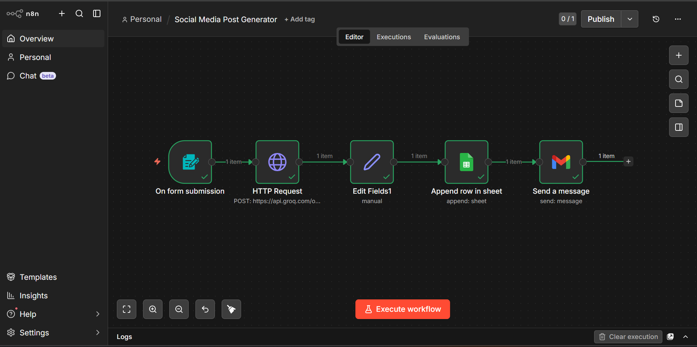
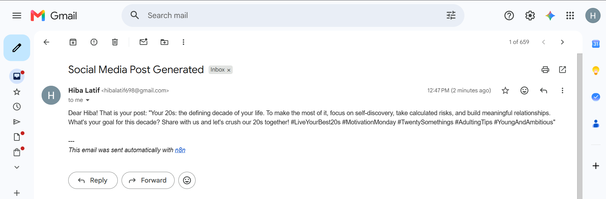

# AI Social Media Post Generator

An AI-powered content generation workflow built with **n8n**, **Groq API**, and **Google Sheets**.

## Features

* Generate social media posts from a user-submitted topic
* Supports multiple platforms (LinkedIn, Instagram, Twitter/X)
* Customizable content tone (Professional, Educational, Casual, Motivational)
* Stores it in Google Sheets
* Send email to author
  
 Creates:

  * Hook
  * Main Content
  * Call To Action (CTA)
  * Relevant Hashtags
* Automatically stores generated posts in Google Sheets

## Workflow

Form Trigger → Groq API → Extract Response → Google Sheets → Send Email

## Tech Stack

* n8n
* Groq API
* Google Sheets
* HTTP Request Node

## Example Input

* Topic: AI Agents
* Platform: LinkedIn
* Tone: Professional

## Example Output

🚀 AI Agents are transforming business operations through automation and intelligent decision-making.

What business process would you automate first?

#AI #Automation #Technology #Innovation
## Workflow Screenshot

## Setup

1. Import the workflow into n8n.
2. Add your Groq API key.
3. Connect Google Sheets credentials.
4. Run the workflow and submit a topic through the form.

## Author

Built as a portfolio project to demonstrate AI-powered workflow automation with n8n.
